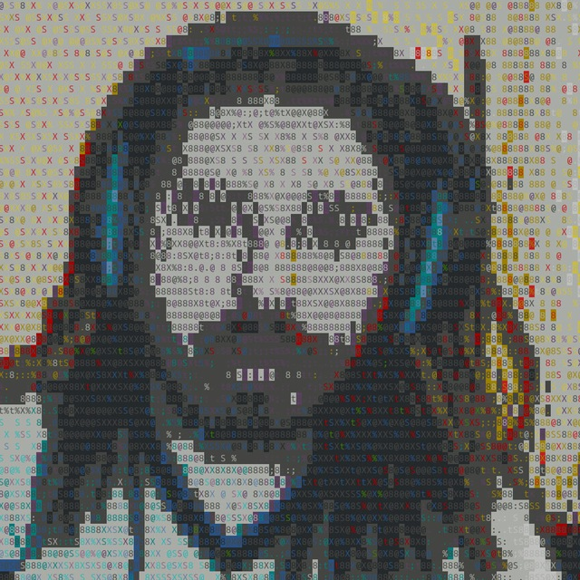
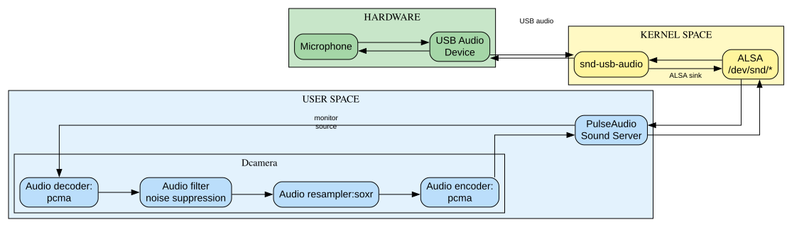
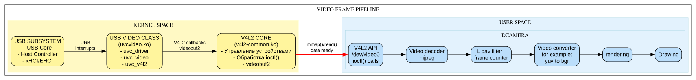
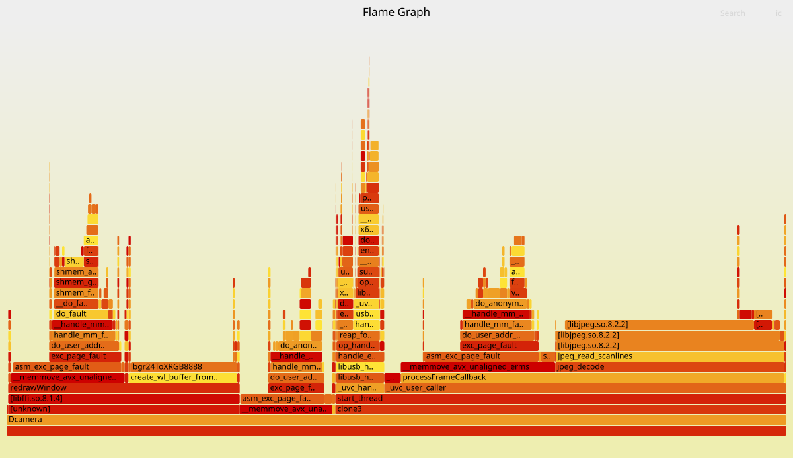

A simple project for capturing audio/video data from a USB camera. 
Using native linux libraries. **No vibe coding**. Just for fun ;)


## 📋 Сontent
- [Capabilities](#-Capabilities)
- [Architecture](#-Architecture)
- [Building](#-Building)
- [Using](#-Using)
- [Possible problems](#-Possible-problems) 
- [Profiling](#-Profiling)
- [License](#-License)
- [Bugs](#-Bugs)
  
## Capabilities

- Audio capture
- Video capture
- Color space conversion via swscale
- Multithreading processing
- ASCII video output
### Supported audio backends
Currently the following audio backends are available:
- libpulse
- libpipewire
- libalsa
### Supported video backends
Currently the following video backends are available:
- video4linux
- libuvc

### supported video frontends
Currently the following video frontends are available:
- Qt6
- Wayland
- X11
- libcaca(ASCII output)

## Architecture

Audio sample pipeline is a loop:

Video frame pipeline:


## Building
### Build dependencies on Ubuntu 24.04

```bash
$ apt-get install \
	cmake make g++ gcc gdb pkg-config libavcodec-dev libswscale-dev libavutil-dev libavfilter-dev libjpeg-dev \
	libspeex-dev libspeexdsp-dev libsoxr-dev alsa-base libasound2-dev libcaca-dev libx11-xcb-dev libxinerama-dev \
	clang libusb-1.0-0-dev libuvc-dev libxcb-image0-dev libxcb-util-dev libwayland-dev libxkbcommon-dev wayland-protocols \
	qtbase5-dev libpulse-dev
```
### Build options

| CMake Option                  | Description                                                                                                       | Default |
| :---------------------------- | :---------------------------------------------------------------------------------------------------------------- | :-----: |
| `USE_VIDEO_BACKEND_V4L2`      | Use V4L2 backend for video from USB camera (`/dev/videoX`)                                                        |  `OFF`  |
| `USE_VIDEO_BACKEND_UVC`       | Use libuvc backend for video from USB camera (using vid/pid)                                                      |  `ON`   |
| `USE_AUDIO_BACKEND_ALSA`      | Use ALSA backend for audio from USB camera                                                                        |  `ON`   |
| `USE_AUDIO_BACKEND_PULSE`     | Use PulseAudio backend for audio from USB camera                                                                  |  `OFF`  |
| `USE_AUDIO_BACKEND_PIPEWIRE`  | Use PipeWire backend for audio from USB camera                                                                    |  `OFF`  |
| `USE_FRONTEND_QT`             | Use Qt framework as frontend                                                                                      |  `ON`   |
| `USE_FRONTEND_X11`            | Use Xlib as frontend                                                                                              |  `OFF`  |
| `USE_FRONTEND_WAYLAND`        | Use Wayland client as frontend                                                                                    |  `OFF`  |
| `USE_FRONTEND_CACA`           | Use libcaca (ASCII-art) as frontend                                                                               |  `OFF`  |
| `USE_LIBSOXR_RESAMPLER`       | Use libsoxr as resampler for audio streams (TODO: does not work correctly with different input stream parameters) |  `ON`   |
| `USE_FRAME_COUNTER`           | Use frame counter from camera                                                                                     |  `ON`   |
| `USE_LIBJPEG_TURBO_DECODER`   | Use libjpeg-turbo decoder instead of libav decoder                                                                |  `ON`   |
| `USE_FFT_NOISE_SUPPRESSION`   | Use FFT-based noise suppression from FFmpeg                                                                       |  `OFF`  |
| `USE_SPEEX_NOISE_SUPPRESSION` | Use noise suppression from speexdsp library                                                                       |  `ON`   |
| `USE_CLANG_COMPILER`          | Use clang and clang++ as compilers                                                                                |  `ON`   |
| `USE_PROFILING`               | Build with profiling support                                                                                      |  `ON`   |
| `USE_CRASH_DUMP`              | Use gdb to obtain stacktrace on crashes                                                                           |  `ON`   |

### Build native

```bash
$ make build
$ cd build
$ cmake -DCMAKE_BUILD_TYPE=Debug -DUSE_VIDEO_BACKEND_V4L2=ON -DUSE_VIDEO_BACKEND_UVC=OFF \
		-DUSE_FRONTEND_QT=OFF -DUSE_FRONTEND_WAYLAND=OFF -DUSE_FRONTEND_CACA=ON \
		-DUSE_FRONTEND_X11=OFF -DUSE_AUDIO_BACKEND_PULSE=OFF -DUSE_AUDIO_BACKEND_PIPEWIRE=OFF \
		-DUSE_AUDIO_BACKEND_ALSA=ON -DUSE_LIBSOXR_RESAMPLER=ON -DUSE_LIBJPEG_TURBO_DECODER=ON \
		-DUSE_FFT_NOISE_SUPRESSION=OFF -DUSE_SPEEX_NOISE_SUPRESSION=ON -DUSE_FRAME_COUNTER=ON \
		-DUSE_CLANG_COMPILER=ON -DUSE_PROFILING=ON -DUSE_CRASH_DUMP=ON ..
$ make -j$(nproc)
```

### Build debian package
```bash
$ dpkg-buildpackage -uc -us -j$(nproc)
```

## Using

### Command line arguments

| Option                       | Description                                                                             |
| :--------------------------- | :-------------------------------------------------------------------------------------- |
| `-l`, `--device-list`        | Get audio sink/source devices list                                                      |
| `-e`, `--devel`              | Enable development logging                                                              |
| `-d`, `--debug`              | Enable debug logging                                                                    |
| `-s`, `--silent`             | Output only fatal log messages                                                          |
| `-v`, `--vid=0x123`          | VID of USB camera (hex format). Primarily for libuvc backend                            |
| `-p`, `--pid=0xeeff`         | PID of USB camera (hex format). Primarily for libuvc backend                            |
| `-f`, `--frame`              | Add frame counter overlay on camera frames                                              |
| `-n`, `--noise-suppression`  | Enable noise suppression                                                                |
| `--geometry`                 | Set output video geometry as `${width}x${height}`                                       |
| `--fps`                      | Set output video framerate. **Warning:** low FPS can cause audio artifacts              |
| `--no-pretty`                | Disable colored terminal output                                                         |
| `--best-quality`             | Use the best possible resolution (video4linux backend only)                             |
| `-c`, `--camera=/dev/videoX` | Specify camera device path (video4linux backend only)                                   |
| `--caca-backend={x11,slang}` | Select libcaca backend (requires library support)                                       |
| `--dither-algo`              | **Dithering algorithm:** `none`, `ordered2`, `ordered4`, `ordered8`, `random`, `fstein` |
| `--dither-charset`           | **Dither character set:** `ascii`, `shades`, `block`                                    |
| `--dither-color`             | **Dither color mode:** `mono`, `fullgray`, `full16`                                     |
| `-h`, `--help`               | Display help message                                                                    |
### Example

```bash
$ LD_PRELOAD=/home/alt/projects/libcaca/caca/.libs/libcaca.so.0.99.20 WAYLAND_DEBUG=1 WAYLAND_DISPLAY=wayland-1 \
	./Dcamera \
	--best-quality \
	-n \
	--pid=0826 \
	--vid=046d \
	--geometry=1280x720 \
	--caca-backend=x11 \
	-f \
	--fps=30 \
	--dither-algo=fstein \
	--dither-charset=block \
	--dither-color=fullgray
```

## Possible problems
-  **If you are using a libuvc backend:**
	See 'libusb' ouput and udev rules if use libuvc. Try to sudo chmod 666 /dev/bus/usb/${bus_number}/${device_number}. For example:
	```bash
	$ lsusb
	Bus 001 Device 007: ID 046d:0826 Logitech, Inc. HD Webcam C525
	```
- **If you  are using a v4l2 backend**
	video4linux framework may not available in your kernel or try:
	```bash
	$ modprobe -r uvcvideo && modprobe uvcvideo
	``` 
- **If you are using a wayland backend**
    wayland compositor(sway, weston...) must be running.
- **If you are using a libcaca backend**
    Yor libcaca library must be supported x11 or slang backend. Try to build libcaca with **--enable-x11** or **--enable-slang**. So, libcaca must be compiled with **imlib2**

## Profiling
Use **USE_PROFILING** build option for this.
```bash
$ perf record -F 99 -p $(pgrep Dcamera) -g -- sleep 30
$ perf script > dcamera.perf
$ git clone https://github.com/brendangregg/FlameGraph.git
$ cd FlameGraph
./stackcollapse-perf.pl /home/korotkov/projects/dcamera/dcamera.perf > out.folded &&  ./flamegraph.pl out.folded > dcamera.svg
```
### Example


## License 

This project is licensed under the GNU General Public License v3.0. See the LICENSE file for details.

## Bugs

The most stable work is observed with libuvc video backend, alsa audio backend and wayland or libcaca frontend

TODO
- Crash with libav mjpeg decoder
- Double free in libcaca backend with swscale converter
- Memory leaks in main loop
